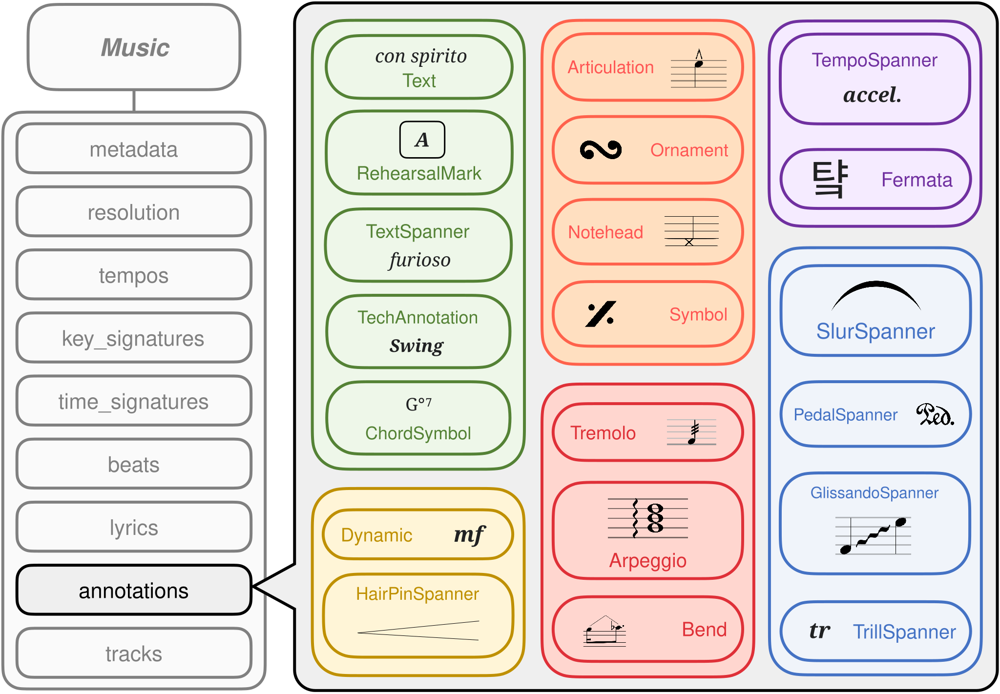

===========
Annotations
===========

MusPy provides several annotation classes for representing performance directives (also known as expression markings) in symbolic music. Here is an illustration of the different annotations that MusPy supports.

These annotation classes are meant to be stored within the ``annotation`` attribute of a :class:`muspy.Annotation` object.
Because :class:`muspy.Annotation` objects store the onset time of an annotation within the ``time`` attribute, none of these annotation classes contain a ``time`` attribute themselves (to avoid storing redundant information).

Implementing New Annotations
============================

To implement a new annotation class in MusPy, please inherit from the :class:`muspy.Base` class (or any of the provided annotation classes).
Please set the following class variables properly:

- ``_attributes``: An OrderedDict with attribute names as keys and their types as values.
- ``_optional_attributes``: A list of optional attribute names.
- ``_list_attributes``: A list of attributes that are lists.

.. toctree::
    :hidden:

    arpeggio
    articulation
    bend
    chord-line
    chord-symbol
    dynamic
    fermata
    glissando-spanner
    hairpin-spanner
    notehead
    ornament
    ottava-spanner
    pedal-spanner
    point
    rehearsal-mark
    slur-spanner
    spanner
    subtype
    subtype-spanner
    symbol
    tech-annotation
    tempo-spanner
    text
    text-spanner
    tremolo
    tremolo-bar
    trill-spanner
    vibrato-spanner
