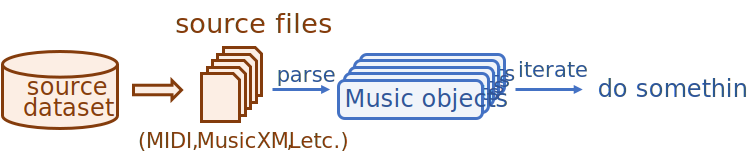

========
Datasets
========

MusPy provides an easy-to-use dataset management system. Each supported dataset comes with a class inherited from the base MusPy Dataset class. MusPy also provides interfaces to PyTorch and TensorFlow for creating input pipelines for machine learning. Here is an example of preparing training data in the piano-roll representation from the NES Music Database using MusPy.

.. code-block:: python

    import muspy

    # Download and extract the dataset
    nes = muspy.NESMusicDatabase("data/nes/", download_and_extract=True)

    # Convert the dataset to MusPy Music objects
    nes.convert()

    # Iterate over the dataset
    for music in nes:
        do_something(music)

    # Convert to a PyTorch dataset
    dataset = nes.to_pytorch_dataset(representation="pianoroll")

Iterating over a MusPy Dataset object
=====================================

Here is an illustration of the two internal processing modes for iterating over
a MusPy Dataset object.

.. image:: images/preconverted1.svg
    :align: center
    :width: 500px

Supported Datasets
==================

Here is a list of the supported datasets.

============================ ======== ====== ======= ========= ====== ====== ==========
Dataset                      Format   Hours  Songs   Genre     Melody Chords Multitrack
============================ ======== ====== ======= ========= ====== ====== ==========
Lakh MIDI Dataset            MIDI      >5000 174,533 misc      \*     \*     \*
MAESTRO Dataset              MIDI     201.21   1,282 classical
Wikifonia Lead Sheet Dataset MusicXML 198.40   6,405 misc      O      O
Essen Folk Song Dataset      ABC       56.62   9,034 folk      O      O
NES Music Database           MIDI      46.11   5,278 game      O             O
Hymnal Tune Dataset          MIDI      18.74   1,756 hymn      O
Hymnal Dataset               MIDI      17.50   1,723 hymn
music21's Corpus             misc      16.86     613 misc      \*            \*
Nottingham Database          ABC       10.54   1,036 folk      O      O
music21's JSBach Corpus      MusicXML   3.46     410 classical               O
JSBach Chorale Dataset       MIDI       3.21     382 classical               O
============================ ======== ====== ======= ========= ====== ====== ==========

(Asterisk marks indicate partial support.)

Base Dataset Classes
====================

Here are the two base classes for MusPy datasets.

.. autoclass:: muspy.Dataset
    :noindex:

.. autoclass:: muspy.RemoteDataset
    :noindex:

Local Dataset Classes
=====================

Here are the classes for local datasets.

.. autoclass:: muspy.FolderDataset
    :noindex:

.. autoclass:: muspy.MusicDataset
    :noindex:

.. autoclass:: muspy.ABCFolderDataset
    :noindex:

Remote Dataset Classes
======================

Here are the classes for remote datasets.

.. autoclass:: muspy.RemoteFolderDataset
    :noindex:

.. autoclass:: muspy.RemoteMusicDataset
    :noindex:

.. autoclass:: muspy.RemoteABCFolderDataset
    :noindex:
