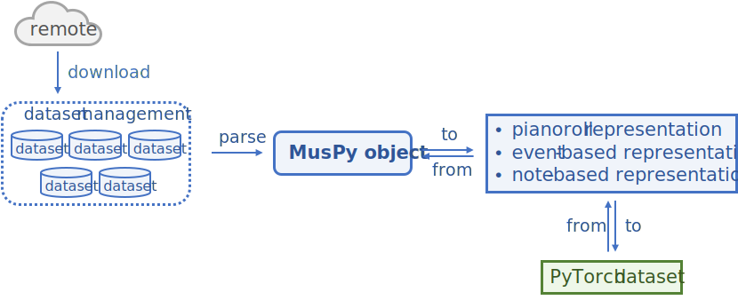

========
Datasets
========

Base Dataset Class
==================

.. autoclass:: muspy.Dataset
    :noindex:

MusicDataset Class
==================

.. autoclass:: muspy.MusicDataset
    :noindex:

FolderDataset Class
===================

.. autoclass:: muspy.FolderDataset
    :noindex:

Example Usage
=============

.. code-block::

    from muspy import LakhMIDIDataset
    lmd = LakhMIDIDataset(download=True, extract=True, convert=True)
