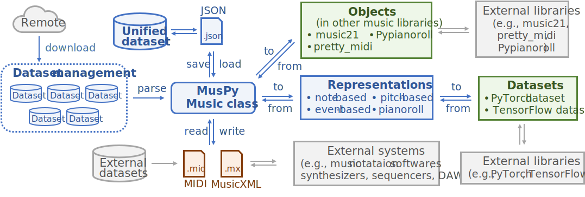

===================
MusPy documentation
===================

MusPy is an open source Python package for machine learning on symbolic music.

Features
========

- Data I/O supports for MIDI and MusicXML
- Loseless saving and loading with JSON/YAML
- Symbolic music representation conversions
- Data manipulation, evaluation and visualization
- Dataset management with interface to PyTorch

Here is a system diagram of the package.

Contents
========

.. toctree::
    :maxdepth: 2

    music
    examples
    timing
    io
    representations
    datasets
    metrics
    visualization
    doc/index
